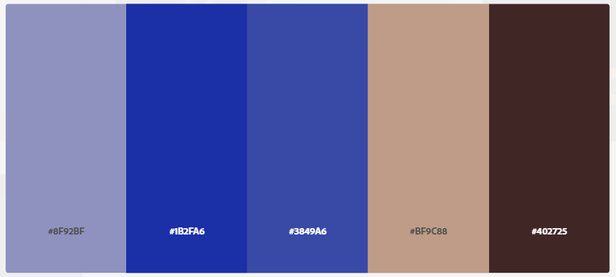

<h1 align="center">
    F.R1.0.0-Experimental-Project.
</h1>

  <a href="#-tecnologias">Tecnology</a>&nbsp;&nbsp;&nbsp;|&nbsp;&nbsp;&nbsp;
  <a href="#-projeto">Project</a>&nbsp;&nbsp;&nbsp;|&nbsp;&nbsp;&nbsp;
  <a href="#-layout">Layout</a>&nbsp;&nbsp;&nbsp;|&nbsp;&nbsp;&nbsp;
  <a href="#memo-licença">License</a>

    <h2>Project still experimental, news and prototype coming soon...</h2>

 

    <figure>
        
        <figcaption>ColorScheme - 1.0.0, WEB/MOBILE, Experimental.</figcaption>
    </figure>

## 🚀 Tecnology

This project still under analisys and Experimental:

- [SASS](https://sass-lang.com/)
- [---]
- [---]
- [---]
- [---]

## 💻 Project

Under Development

## 🔖 Layout

On follow links you will find the web project and mobile.
Rememberm you need to have account on [Figma](http://figma.com/).

- [Layout Web](Under Construction)
- [Layout Mobile](Under Construction)

## :memo: License

Under MIT license.[LICENSE](LICENSE.md).
